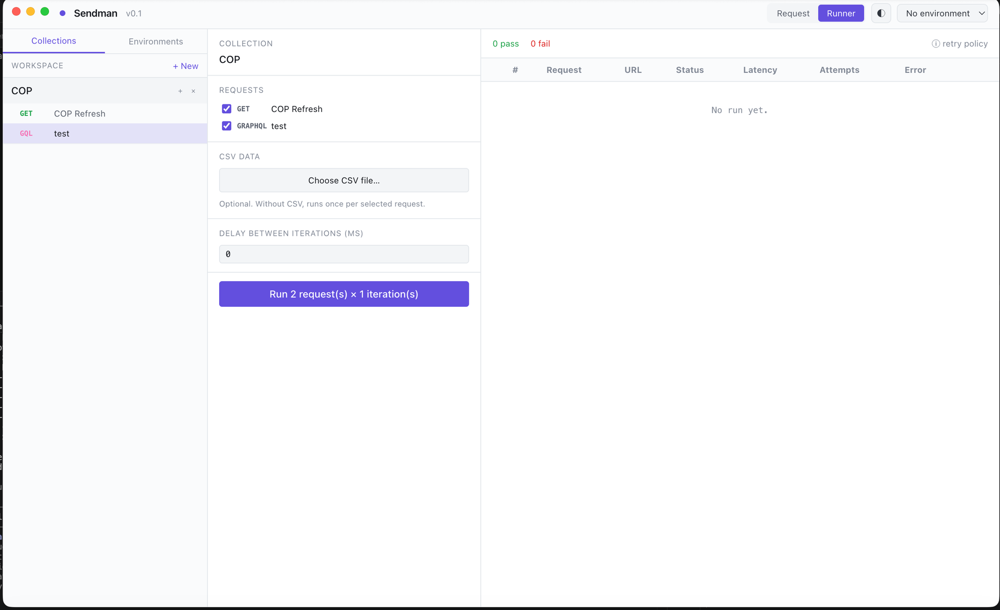

# Sendman

A local-first desktop API client for HTTP, GraphQL, gRPC, and WebSocket — built with Electron + Vite + React + TypeScript + Tailwind + Zustand.



---

## Features

- **HTTP/REST** — all methods, JSON/text/form/raw bodies, Basic & Bearer auth, query params
- **GraphQL** — query/mutation editor with variables
- **gRPC** — unary calls via `.proto` file (server hardcoded to `localhost:50051` in v0.1)
- **WebSocket** — persistent connections with send/receive message log
- **Environments** — `{{variable}}` substitution in URLs, headers, params, body
- **Collection Runner** — CSV-driven batch execution with live streaming results
- **Resilience** — per-request timeout, retry count, retry-on status codes, exponential backoff with jitter
- **curl import/export** — paste a curl command to populate a request; copy any request as curl

---

## Architecture

Sendman uses Electron's two-process model with strict context isolation.

```
┌──────────────────────────────────────────────────────┐
│  Renderer Process (sandboxed, no Node.js access)     │
│                                                       │
│  React + Zustand                                      │
│  ┌──────────┐  ┌─────────────┐  ┌────────────────┐  │
│  │ Sidebar  │  │ RequestView │  │ ResponsePanel  │  │
│  │          │  │ (HTTP/GQL/  │  │                │  │
│  │ TopBar   │  │  gRPC/WS)   │  │ RunnerView     │  │
│  └──────────┘  └─────────────┘  └────────────────┘  │
│                        │                              │
│               window.api.* (typed IPC bridge)        │
└───────────────────────┬──────────────────────────────┘
                        │  contextBridge (preload.ts)
                        │  IPC invoke / on
┌───────────────────────┴──────────────────────────────┐
│  Main Process (Node.js, owns filesystem + network)   │
│                                                       │
│  main.ts      — window lifecycle, registers handlers  │
│  preload.ts   — security bridge (window.api → IPC)   │
│  store.ts     — file-based JSON persistence           │
│  http.ts      — HTTP + GraphQL via undici             │
│  grpc.ts      — gRPC via @grpc/grpc-js                │
│  websocket.ts — WebSocket via ws                      │
│  runner.ts    — CSV batch runner, streams progress    │
│  vars.ts      — {{var}} substitution engine           │
└──────────────────────────────────────────────────────┘
                        │
             Filesystem / Network / gRPC server
```

### Data flow

```
User input
  → Renderer (React + Zustand store)
  → window.api.<namespace>.<action>()          ← IPC invoke
  → Main process handler (http / grpc / ws / runner)
  → External resource (HTTP server, gRPC, WebSocket, filesystem)
  → Response returned over IPC
  → Renderer state update → UI re-render
```

### Storage

Workspace data is persisted as plain JSON under:

```
~/Library/Application Support/Sendman/workspace/
  collections/<id>.json
  environments/<id>.json
```

Git-friendly and hand-editable. Do not commit files that contain credentials.

### Source layout

```
Sendman/              Main process (TypeScript)
  main.ts             Window + IPC bootstrap
  preload.ts          window.api → ipcRenderer bridge
  store.ts            File-based collection/env persistence
  http.ts             HTTP + GraphQL executor (undici)
  grpc.ts             gRPC executor (@grpc/grpc-js)
  websocket.ts        WebSocket handler (ws)
  runner.ts           Sequential batch runner
  vars.ts             {{var}} substitution

src/                  Renderer (React + Vite)
  App.tsx             Root layout
  store.ts            Zustand state
  types.ts            Shared types + window.api interface
  components/
    Sidebar.tsx       Collections + Environments tabs
    TopBar.tsx        Protocol picker, env selector, Runner toggle
    RequestView.tsx   HTTP request editor
    GraphQLRequestView.tsx
    GrpcRequestView.tsx
    WebSocketRequestView.tsx
    ResponsePanel.tsx Protocol-aware response rendering
    RunnerView.tsx    CSV runner UI + live results
    EnvironmentEditor.tsx
    VarPopover.tsx    {{var}} helper
  lib/
    curl.ts           curl → request import
    curlExport.ts     Request → curl export
    vars.ts           Client-side variable preview
```

---

## Running locally (development)

```bash
# Install dependencies
npm install

# Start dev server (Vite on :5173) + Electron
npm run dev
```

Hot reload works for the React UI. Changes to anything under `Sendman/` require restarting the Electron process.

---

## Installing on macOS

### Option A — Use the pre-built DMG (recommended)

1. Download `release/Sendman-0.1.0-arm64.dmg` (Apple Silicon) or `release/Sendman-0.1.0.dmg` (Intel / universal).
2. Open the `.dmg` file.
3. Drag **Sendman** into your **Applications** folder.
4. Eject the DMG.
5. Open Sendman from Applications.

**First launch on macOS (unsigned build):** macOS will block the app with *"cannot be opened because the developer cannot be verified"*.

- Right-click (or Control-click) the app in Applications → **Open**.
- Click **Open** again in the security dialog.

You only need to do this once. After that, double-clicking works normally.

> To remove this friction: add a Developer ID certificate under `build.mac.identity` in `package.json` and re-run `npm run dist:mac:dmg`.

### Option B — Build the DMG yourself

```bash
# Builds renderer + main process, then packages as .dmg
npm run dist:mac:dmg
```

Output lands in `release/`. Both `arm64` and `x64` targets are built by default (universal binary). Then follow steps 2–5 above.

---

## Using Sendman

### Collections & requests

1. **Sidebar → Collections tab → + New** — create a collection.
2. **+ button** next to a collection name — add a request.
3. Set **protocol** (HTTP, GraphQL, gRPC, WebSocket), **method**, **URL**, headers, params, body, auth.
4. Click **Send**. The response panel shows status code, latency, headers, and pretty-printed body.

### Variables

Use `{{name}}` anywhere in URLs, headers, params, or body.

1. **Sidebar → Environments tab → + New** — create an environment, add key/value pairs.
2. Select the active environment from the top bar.
3. Values are substituted at execution time in the main process.

### Resilience (HTTP / GraphQL / gRPC)

Per-request settings:

| Setting | Description |
|---|---|
| **Timeout** | Max milliseconds before the request is aborted |
| **Max attempts** | Total tries (1 = no retry) |
| **Retry statuses** | HTTP status codes that trigger a retry (e.g. `429,503`) |

Retries use exponential backoff with jitter. Network failures (status 0) always retry up to `maxAttempts`.

### Collection Runner

1. **Top bar → Runner** — opens the runner panel.
2. Select a **collection** and check the requests to include.
3. Optionally upload a **CSV** file. The header row defines variable names; each data row is one iteration. Rows override environment variables.
4. Set **delay between requests** (ms).
5. Click **Run**. Results stream live — status, latency, pass/fail per request per row.

### curl import / export

- **Import**: paste a `curl` command into an HTTP request's URL bar and hit Enter — method, headers, and body are auto-populated.
- **Export**: click **Copy as curl** on any request to get a ready-to-run command. gRPC and WebSocket requests generate `grpcurl` / `wscat` suggestions instead.

---

## Protocol notes

| Protocol | Status | Notes |
|---|---|---|
| HTTP/REST | Full | All methods, all body types, Basic/Bearer auth |
| GraphQL | Full | Query + variables editor, sends as POST |
| gRPC | Partial | Unary only; server address fixed to `localhost:50051` |
| WebSocket | Full | Persistent connections, send/receive log |

---

## What's not in v0.1

OAuth 2.0, JavaScript scripting/assertions, parallel runner, circuit breaker, cloud sync, team workspaces, gRPC streaming, WebSocket runner support.
