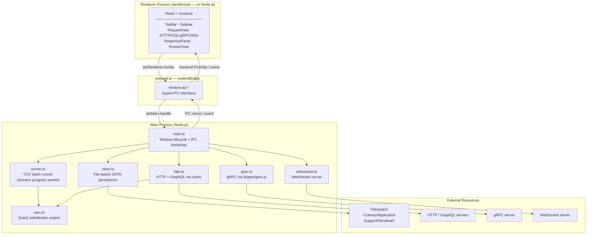

# Sendman

> A local-first, open-source desktop API client for HTTP, GraphQL, gRPC, and WebSocket.

Built with **Electron · Vite · React · TypeScript · Tailwind · Zustand**.  
No accounts. No cloud. Your data stays on your machine.


---

## Table of contents

- [Features](#features)
- [Architecture](#architecture)
- [Getting started](#getting-started)
- [Installing on macOS](#installing-on-macos)
- [Usage guide](#usage-guide)
- [Contributing](#contributing)
- [Project structure](#project-structure)
- [Roadmap](#roadmap)
- [License](#license)

---

## Features

| | |
|---|---|
| **HTTP / REST** | All methods, JSON / text / form / raw bodies, Basic & Bearer auth, query params |
| **GraphQL** | Query + mutation editor with variables |
| **gRPC** | Unary calls via `.proto` file |
| **WebSocket** | Persistent connections with timestamped send/receive log |
| **Environments** | `{{variable}}` substitution in URLs, headers, params, body |
| **Collection Runner** | CSV-driven batch execution with live-streaming results |
| **Resilience** | Per-request timeout, retry count, retry-on-status-code, exponential backoff + jitter |
| **curl import / export** | Paste a curl command to populate any HTTP request; copy any request as curl |

---

## Architecture

Sendman uses Electron's two-process model with strict context isolation — the renderer has no direct Node.js access.



### Data flow

```
User input
  → React component dispatches action → Zustand store
  → window.api.<namespace>.<action>()       [IPC invoke]
  → Main process picks up in ipcMain.handle
  → vars.ts substitutes {{variables}}
  → Protocol executor (http / grpc / websocket / runner)
  → External resource (network / filesystem)
  → Result returned over IPC
  → Zustand state updated → React re-renders
```

### Storage

Collections and environments are stored as plain JSON — no database, no binary formats:

```
~/Library/Application Support/Sendman/workspace/
  collections/<uuid>.json
  environments/<uuid>.json
```

Files are git-friendly, diff-readable, and hand-editable. **Do not commit workspace files that contain credentials.**

---

## Getting started

### Prerequisites

- **Node.js** ≥ 18
- **npm** ≥ 9
- macOS (Linux/Windows builds are untested in v0.1)

### Install and run

```bash
git clone https://github.com/your-org/sendman.git
cd sendman
npm install
npm run dev
```

Vite starts on `:5173`; Electron opens automatically pointed at it.  
Hot reload works for the React UI. Changes under `Sendman/` require restarting Electron (`Ctrl+C` → `npm run dev`).

### Available scripts

| Command | Description |
|---|---|
| `npm run dev` | Dev server (Vite + Electron with hot reload) |
| `npm run build` | Compile TypeScript + bundle renderer |
| `npm run dist:mac:dmg` | Build + package as `.dmg` (arm64 + x64) |
| `npm run preview` | Preview the production renderer build |

---

## Installing on macOS

### Option A — Pre-built DMG

1. Download from [Releases](https://github.com/your-org/sendman/releases):
   - `Sendman-0.1.0-arm64.dmg` — Apple Silicon
   - `Sendman-0.1.0.dmg` — Intel / universal
2. Open the `.dmg`, drag **Sendman** to **Applications**, eject the DMG.
3. Open Sendman from Applications.

**First launch (unsigned build):** macOS blocks the app with "developer cannot be verified".

- Right-click (or Control-click) the app → **Open** → **Open** again on the dialog.
- You only need to do this once.

> To remove this step permanently: add a Developer ID certificate to `build.mac.identity` in `package.json` and rebuild.

### Option B — Build it yourself

```bash
npm run dist:mac:dmg
# Output → release/Sendman-0.1.0-arm64.dmg (and x64 variant)
```

Then follow steps 2–3 above.

---

## Usage guide

### Collections and requests

1. **Sidebar → Collections → + New** — create a collection.
2. **+** next to a collection name — add a request.
3. Choose a **protocol** (HTTP, GraphQL, gRPC, WebSocket), set method + URL, configure headers/params/body/auth.
4. **Send** — response panel shows status, latency, headers, pretty-printed body.

### Environments and variables

Use `{{name}}` anywhere in URLs, headers, params, or body.

1. **Sidebar → Environments → + New** — create an environment, add key/value pairs.
2. Select the active environment in the top bar.
3. Variables are substituted in the main process at execution time (not in the UI preview).

### Resilience

Per-request settings available for HTTP, GraphQL, and gRPC:

| Setting | Description |
|---|---|
| **Timeout** | Max ms before the request is aborted |
| **Max attempts** | Total tries (1 = no retry) |
| **Retry statuses** | HTTP status codes that trigger a retry, e.g. `429,503` |

Retries use exponential backoff with jitter. Network failures (status 0) always retry up to `maxAttempts` regardless of `retryStatuses`.

### Collection Runner

1. **Top bar → Runner**.
2. Select a collection, check the requests to include.
3. Optionally upload a **CSV** — header row = variable names, each data row = one iteration. Row variables override the active environment.
4. Set delay between requests (ms).
5. **Run** — results stream live per request per row.

### curl import / export

- **Import**: paste a `curl` command into an HTTP request's URL bar and press Enter — method, headers, and body are auto-populated.
- **Export**: **Copy as curl** on any request. gRPC / WebSocket requests produce `grpcurl` / `wscat` equivalents.

---

## Contributing

Contributions are welcome. Please read this section before opening a PR.

### Reporting bugs

Open an issue with:
- OS and version
- Steps to reproduce
- Expected vs actual behaviour
- Any console output (open DevTools with `Cmd+Option+I`)

### Requesting features

Open an issue tagged `enhancement`. Describe the use case, not just the solution.

### Submitting a pull request

```bash
# 1. Fork the repo and clone your fork
git clone https://github.com/<your-username>/sendman.git
cd sendman

# 2. Create a feature branch
git checkout -b feat/your-feature-name

# 3. Install dependencies
npm install

# 4. Make changes, verify with dev server
npm run dev

# 5. Build to catch TypeScript errors
npm run build

# 6. Commit using Conventional Commits
git commit -m "feat: add server address field for gRPC"

# 7. Push and open a PR against main
git push origin feat/your-feature-name
```

**Guidelines:**
- Follow the existing code style (TypeScript strict, Tailwind utility classes).
- Keep PRs focused — one feature or fix per PR.
- Renderer code lives in `src/`; main-process code lives in `Sendman/`. Don't mix them.
- New IPC channels need changes in all five places: handler, `main.ts` registration, `preload.ts` bridge, `types.ts` interface, and the renderer call site.
- No new dependencies without discussion in an issue first.

### Commit conventions

This project follows [Conventional Commits](https://www.conventionalcommits.org/):

```
feat:     new feature
fix:      bug fix
refactor: code change with no behaviour change
docs:     documentation only
chore:    build / tooling / config
```

---

## Project structure

```
sendman/
├── Sendman/                  Main process (Node.js / TypeScript)
│   ├── main.ts               Window lifecycle + IPC handler registration
│   ├── preload.ts            contextBridge — exposes window.api to renderer
│   ├── store.ts              File-based collection + environment persistence
│   ├── http.ts               HTTP + GraphQL executor (undici)
│   ├── grpc.ts               gRPC executor (@grpc/grpc-js + proto-loader)
│   ├── websocket.ts          WebSocket connections (ws)
│   ├── runner.ts             CSV batch runner with IPC progress streaming
│   └── vars.ts               {{var}} substitution engine
│
├── src/                      Renderer process (React + Vite)
│   ├── App.tsx               Root layout
│   ├── store.ts              Zustand state (collections, envs, responses)
│   ├── types.ts              Shared TypeScript types + window.api interface
│   ├── components/
│   │   ├── TopBar.tsx        Protocol picker, env selector, Runner toggle
│   │   ├── Sidebar.tsx       Collections + Environments tabs
│   │   ├── RequestView.tsx   HTTP request editor
│   │   ├── GraphQLRequestView.tsx
│   │   ├── GrpcRequestView.tsx
│   │   ├── WebSocketRequestView.tsx
│   │   ├── ResponsePanel.tsx Protocol-aware response rendering
│   │   ├── RunnerView.tsx    CSV runner UI + live result table
│   │   ├── EnvironmentEditor.tsx
│   │   └── VarPopover.tsx    {{var}} helper popover
│   └── lib/
│       ├── curl.ts           curl command → request import parser
│       ├── curlExport.ts     Request → curl export generator
│       ├── vars.ts           Client-side variable preview (renderer only)
│       └── beautify.ts       JSON / XML pretty-printer
│
├── scripts/
│   └── rename-dev-electron.js  Build helper
├── public/                   Static assets
├── index.html                Vite entry point
├── vite.config.mts
├── tailwind.config.js
├── tsconfig.json
└── package.json
```

---

## Roadmap

| Phase | Scope |
|---|---|
| **v0.1** (current) | HTTP/REST, GraphQL, gRPC (unary), WebSocket, environments, `{{vars}}`, retry/timeout, CSV runner |
| **v0.2** | gRPC streaming, configurable gRPC server address, WebSocket runner integration |
| **v0.3** | JavaScript scripting + assertions per request |
| **v0.4** | OAuth 2.0 flows, API key management |
| **v0.5** | Parallel runner, circuit breaker |
| **v1.0** | Cloud sync, team workspaces, plugin SDK |

See [`PROTOCOL_FEATURES.md`](PROTOCOL_FEATURES.md) for a full per-protocol feature breakdown.

---

## License

[MIT](LICENSE)
